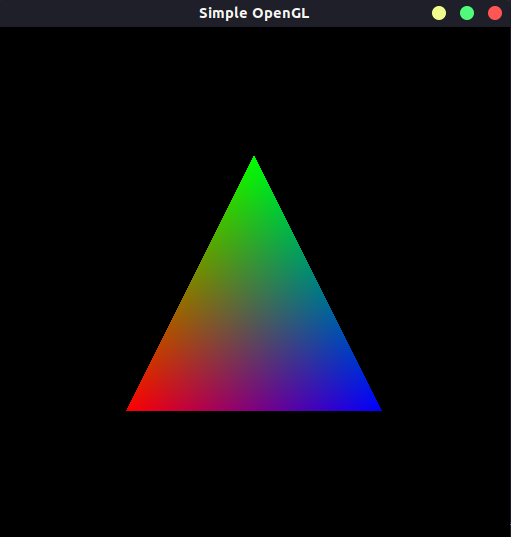

# OpenGL - Atividade 01 (Simple OpenGL)

> O trabalho é referente a primeira atividade da disciplina de Introdução a Computação Gráfica. O programa deverá apresentar uma janela contendo um triangulo colorido.


[](https://www.opengl.org)


## Objetivos
<ol>
    <li>Verificar se o ambiente de desenvolvimento em OpenGL 3.3 estão corretamente configurado nos computadores dos alunos;</li>
    <li>Familizarizar os alunos com a estrutura de um programa OpenGL moderno;</li>
</ol>

## Objetivos concluídos

- [x] Verificar se o ambiente de desenvolvimento em OpenGL 3.3 estão corretamente configurado nos computadores dos alunos;
- [x] Familizarizar os alunos com a estrutura de um programa OpenGL moderno;

## Dificuldades encontradas

Não foram encontradas nenhuma dificuldades para executar os códigos disponibilizados.

## Pré-requisitos

Rode os seguintes comandos para instalar o OpenGl:

```sh
$ sudo apt-get update
$ sudo apt-get install libglu1-mesa-dev freeglut3-dev mesa-common-dev
```

## Utilização

Para executar o código primeiro deve-se criar o arquivo compilado para ser executado, para isso execute os seguintes comandos:

```sh
$ cd modern_opengl/
$ gcc main.c -o [nome executável] -lglut -lGLU -lGL
```

Após isso, basta executar o programa da seguinte forma:
```sh
$ ./[nome executável]
```

## Histórico de Lançamentos

* 0.0.2
    * README adicionado

* 0.0.1
    * Trabalho em progresso

## Meta

### Alunos
<ul>
    <li>Bruno Oliveira Sales – 20160111893 – brunosales@eng.ci.ufpb.br</li>
    <li>Vinícius Guedes da Silva – 20190169366 – viniciusguedes@lavid.ufpb.br</li>
</ul>

Dísponivel em:

[Repositório Atividade](https://github.com/capagot/icg)
