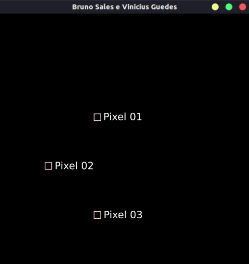
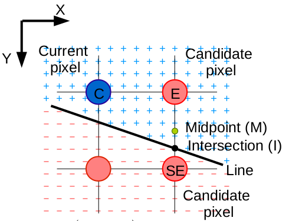
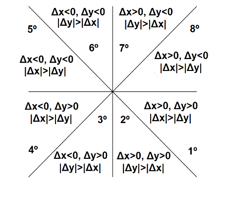
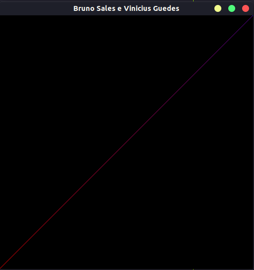
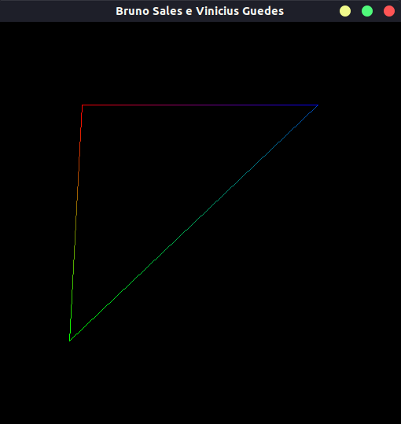

# OpenGL - Atividade 02 (Rasterizando linhas)

> Esse trabalho consiste na implementação de algoritmos para a rasterização de pontos e linhas. Ele deverá desenhar um ponto, uma linha e um triângulo em tela.


[](https://www.opengl.org)
<br>

## Objetivos
<ol>
  <li>Exibir um pixel em tela</li>
  <li>Exibir uma linha em tela</li>
  <li>Exibir um triangulo com interpolação linear nas cores do seu contorno</li>
</ol>

## Pré-requisitos

Rode os seguintes comandos para instalar o OpenGl:

```sh
$ sudo apt-get update
$ sudo apt-get install libglu1-mesa-dev freeglut3-dev mesa-common-dev
```


## Desenvolvimento
> Foi fornecido um framework, pelo professor, para simular o acesso direto à memória de vídeo. O repositorio pode ser acessado [clicando aqui ](https://github.com/capagot/icg/tree/master/02_mygl_framework "Clique aqui para acessar ")


### Passo 01 - Rasterização de pontos

A rasterização é um processo de converter primitivas matemáticas em pixels e exibi-las em tela. Para isso, primeiro foi necessario encontrar o endereço da memória de vídeo e configurar as cores. Cada componente de cor (Red, Green, Blue, Alpha) desse sistema ocupa 1 byte (8 bits) de memoria, consequentemente cada um dos pixels que compoem a tela possuem 4 bytes. Dessa maneira, pode-se concluir que o tamanho da tela é dado pelo multiplicação da quantidade de `linhas` e `colunas`. E a localização de cada pixel na memoria é dada pela formula:

```
  offset(x, y) = 4 * x + 4 * y * width
```

Essa formula foi traduzida para a função que recebe as coordenadas `x`, `y` e a `cor`:


```c
  void PutPixel(int x, int y, int *color) {
    for(int i = 0; i < 4; i++){
      fb_ptr[4*y*IMAGE_WIDTH + 4*x + i] = color[i];
    }
  }
```
Ao chamar a função `PutPixel` no `void MyGlDraw(void)`, o resultado obtido é a inserção de um pixel em tela

```c
  PutPixel(100, 200, red);
  PutPixel(200, 100, green);
  PutPixel(200, 300, blue);
```

Pode-se ver o resultado logo abaixo:




### Passo 02 - Rasterização de linhas

Após a exibição do pixel em tela, precisa-se definir uma função para a rasterizar as linhas. Para isso, iremos utilizar uma variação do algoritmo de Bresenham - o algoritmo do ponto médio. O seu objetivo é determinar os pixels a serem "acendidos" para atender o grau de inclinação de um ângulo. Entretanto, o problema da solução proposta por Bresenham é que ele se limita a um segmento de reta entre 0º e 45º, fazendo com que ele seja eficiente para o primeiro octante. Por esse motivo, faz-se necessario a adaptação desse algoritmo para que ele atenda todos os oito octantes.

Para adaptação do algoritmo, foi necessário alterar o código ao modo que ele percorra todos os oito octantes. Para isso, cada octante possui a sua característica variando os seus coeficientes angulares. Também foi necessário se atentar ao eixo y, para essa limitação, visto que ele se comporta de forma invertida.


 


Desse modo, o algoritmo foi adaptado e o seu pseudo-código pode ser descrito da seguinte forma:

```c
    if(dx < 0){
        pX = -1;
    }else{
        pX = 1;
    }

    if(dy < 0){
        pY = -1;
    }else{
        pY = 1;
    }
```

Após a implementação correta dos octantes, basta chamar a função `DrawLine` passando como parametro o `struct` correspondente da linha
```c
void DrawLine(struct Line line) {
  ...
  struct Line line;

  line.x0 = 0;
  line.y0 = 0;
  line.x1 = 511;
  line.y1 = 511;
  line.color0 = red;
  line.color1 = blue;
  DrawLine(line);
  ...
}
```

As arestas que irão compôr o triângulo possuem cores sólidas da escala em RGB. Entretanto, foi requisitado a interpolação gradual da cor, ou seja, que cada aresta presente no triângulo seja aplicado esse efeito. Ele consiste basicamente em um degradê, que recebe um valor da cor no início e progride de forma suave até o final da linha até alcançar a cor final estabelecida, dando a ideia de uma mudança menos rígida da cor. Para isso, foi feito o cálculo das variações de cada componente RGB da cores (inicial e final) e dividir pelo Δx ou Δy. Feito essa etapa, basta somente ir adicionando o delta na cor e aplicando na reta. Com isso, o efeito da figura é realizado com sucesso.




### Passo 03 - Rasterização de triângulos
A estrátegia para a implementação dessa funcionalidade, descrita na função `DrawTriangle`, foi de chamar a função para a rasterização das linhas (`DrawLine`) três vezes para a composição das arestas do triângulo. Para isso, foi utilizado as mesmas funcionalidades descritas no `Passo 02`.



```c
void DrawTriangle(struct Triangle triangle) {

    ...

    DrawLine(line0);
    DrawLine(line1);
    DrawLine(line2);

    ...
}
```

## Objetivos concluídos

- [x] Exibir um pixel em tela
- [x] Exibir uma linha em tela
- [x] Exibir um triangulo com interpolação linear nas cores do seu contorno


## Dificuldades encontradas

O trabalho foi realizado corretamente e todos os objetivos foram alcançados, no entanto algumas dificuldades surgiram. A dificuldade principal foi na lógica da função `DrawLine`, especificamente na implementação da generelização dos octantes e na definição do gradiente. Não obstante, contornamos esses problemas assistindo novamente as aulas e, através delas, conseguimos construir uma boa base teorica o que facilitou no entendimento do algoritmo do ponto médio.

## Utilização

Para executar o código primeiro deve-se criar o arquivo compilado para ser executado, para isso execute os seguintes comandos:

```sh
$ cd 02_mygl_framework/
$ make clean
$ make -f Makefile
```

Após isso, basta executar o programa da seguinte forma:
```sh
$ ./mygl
```

## Histórico de Lançamentos

* 0.0.1
    * Trabalho Concluído


### Alunos
<ul>
    <li>Bruno Oliveira Sales – 20160111893 – brunosales@eng.ci.ufpb.br</li>
    <li>Vinícius Guedes da Silva – 20190169366 – viniciusguedes@lavid.ufpb.br</li>
</ul>

Disponivel em:

[Repositório Atividade](https://github.com/capagot/icg)
