# OpenGL - Atividade 03 (Pipeline Gráfico)

> O trabalho consiste em familiarizar os alunos com a estrutura do pipeline gráfico através da implementação das transformaçõesoes geometricas que o compõem.

>  Esta implementação será feita com auxílio da biblioteca glm e sua execução ocorrerá nos shaders do OpenGL.


[](https://www.opengl.org)
<br>

## Objetivos


## Pré-requisitos

Rode os seguintes comandos para instalar o OpenGl:

```sh
$ sudo apt-get update
$ sudo apt-get install libglu1-mesa-dev freeglut3-dev mesa-common-dev
$ sudo apt-get install libglew-dev
```


## Desenvolvimento
> Esta atividade de implementação será feita a partir de um código template C++17 disponibilizado pelo professor e que está disponível no repositório da disciplina [clicando aqui ](https://github.com/capagot/icg/tree/master/03_transformations)


### Exercício 1: Escala

Este exercicio tem como objetivo modificar a matriz Model de forma que a imagem original gerada pelo programa seja transformada na imagem abaixo:


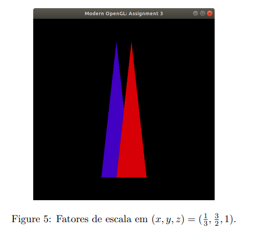

A transformação na escala muda as proporções do objeto e podem ser: Isotrópica e Anisotrópica.

A Isotrópica é onde não há alteração do aspecto do objeto (a escala para todas as coordenadas do objeto é igual). Enquanto que na Anisotrópica ocorre a alteração na escala para pelo menos uma das coordenadas.

Dessa maneira, temos os fatores escala em (x, y, z) = ( 1/3 , 3/2 , 1). E pode-se calcular os valores da matriz da seguinte forma:

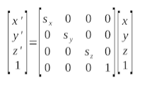

Dado isso, a matriz modificada fica da seguinte forma:

```c
    float model_array[16] = {0.333f, 0.0f, 0.0f, 0.0f,
                         0.0f, 1.5f, 0.0f, 0.0f,
                         0.0f, 0.0f, 1.0f, 0.0f,
                         0.0f, 0.0f, 0.0f, 1.0f};
```

Ao substituir os valores no local indicado, obteve-se o seguinte resultado:

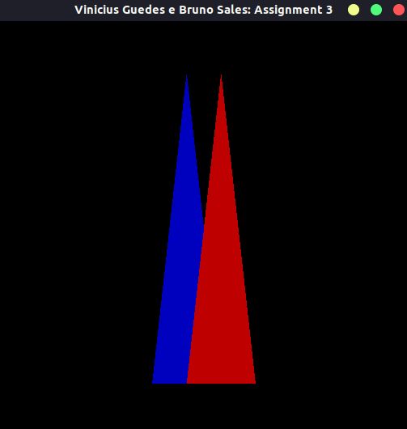


### Exercício 02 - Translação

Modificar a matriz Model de forma que a imagem gerada pelo programa fique igual a imagem abaixo:

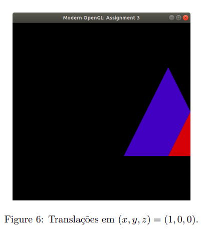

A modificação foi realizada a partir da seguinte formula:

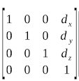

Temos os fatores de Translação (x, y, z) = (1, 0, 0). Com isso a matriz modificada fica da seguinte forma:

```c
    float model_array[16] = {1.0f, 0.0f, 0.0f, 0.0f,
                             0.0f, 1.0f, 0.0f, 0.0f,
                             0.0f, 0.0f, 1.0f, 0.0f,
                             1.0f, 0.0f, 0.0f, 1.0f};
```

Feito isso, obtivemos o seguinte resultado:

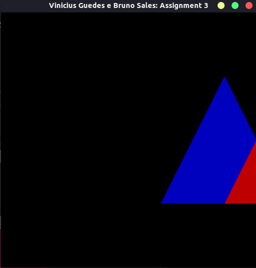


### Exercício 03 -  Projeção Perspectiva

Para obter-se os valores da matriz foi utilizada a seguinte formula:

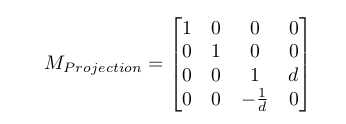

Dessa maneira, obtivemos o seguinte resultado:

```c
  float proj_array[16] = {1.0f, 0.0f, 0.0f, 0.0f,
                          0.0f, 1.0f, 0.0f, 0.0f,
                          0.0f, 0.0f, 1.0f, -8.0f,
                          0.0f, 0.0f, 0.125, 0.0f};
```

Como resultado obtivemos:

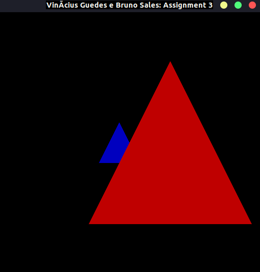

### Exercício 04 -  Posição da Câmera

Foi necessário montar uma nova Mview e utilizar a Mprojection do exercício anterior Dessa maneira, precisou-se transformar o Espaço do Universo para o da Câmera. O que representa uma mudança de sistemas de coordenadas que irá levar os vértices do objeto para o da câmera, realizando-se assim a mudança de base.

Para gerar a nova Mview, foi utilizado os parâmetros fornecidos no documento de referencia para determinar os vetores da base do espaço câmera, sendo eles: camera_posicao (p), vetor_up (u), camera_direcao (d)

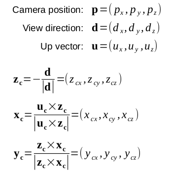


A matriz Mview foi construída a partir da matriz resultante da multiplicação da: matriz Btransposta e da matriz de Translação. Descritas como:

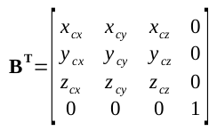

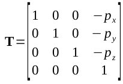

Dessa maneira, pode-se obter o seguinte código:

```c
    glm::vec3 pos_cam = glm::vec3(-0.1f, 0.1f, 0.25f);
    glm::vec3 up_cam = glm::vec3(0.0f, 1.0f, 0.0f);
    glm::vec3 ponto_cam = glm::vec3(0.0f, 0.0f, 0.0f);


    glm::vec3 z_cam = -glm::normalize(ponto_cam - pos_cam);
    glm::vec3 x_cam = glm::normalize(glm::cross(up_cam, z_cam));
    glm::vec3 y_cam = glm::normalize(glm::cross(z_cam, x_cam));

    float Bt_aux[16]={x_cam[0], y_cam[0], z_cam[0], 0.0f,
                      x_cam[1], y_cam[1], z_cam[1], 0.0f,
                      x_cam[2], y_cam[2], z_cam[2], 0.0f,
                      0.0f,0.0f,0.0f, 1.0f};

    float T_aux[16]={1.0f, 0.0f, 0.0f, 0.0f,
                     0.0f, 1.0f, 0.0f, 0.0f,
                     0.0f, 0.0f, 1.0f, 0.0f,
                    -pos_cam[0], -pos_cam[1], -pos_cam[2], 1.0f};

    glm::mat4 T = glm::make_mat4(T_aux);
    glm::mat4 Bt = glm::make_mat4(Bt_aux);

    glm:: mat4 view_mat = Bt * T;
```

Que resultou na seguinte figura:

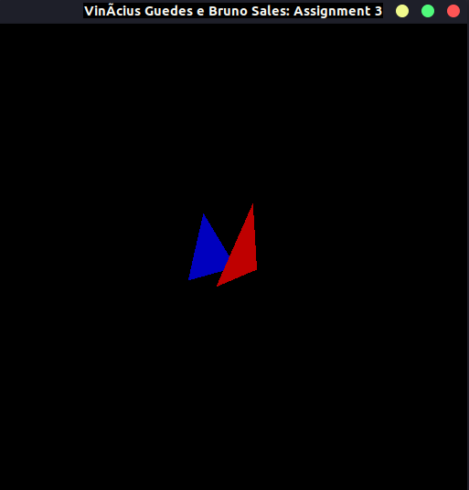


### Exercício 5 - Transformações Livres

Neste exercício se faz necessario fazer modificações nas matrizes MModel, MView e MProjection de forma a gerar uma cena diferente das geradas anteriormente. Para isso, fez-se necessario alterar os valores de ambas as três matrizes.

Matriz Model
```c
float model_array[16] = {2.0f, 0.0f, 0.0f, 0.0f,
                         0.0f, 1.7f, 0.0f, 0.0f,
                         0.0f, 0.0f, 1.0f, 0.0f,
                         0.0f, 0.0f, 0.0f, 1.0f};
```

Matriz View
```c
float view_array[16] = {-1.0f, 0.0f, 0.0f, 0.0f,
                         0.0f, -1.0f, 0.0f, 0.0f,
                         0.0f, 0.0f, 1.0f, 0.0f,
                         0.0f, 0.0f, 0.0f, 1.0f};
```

Matriz Projection
```c
float proj_array[16] = {1.0f, 0.0f, 0.0f, 0.0f,
                        0.0f, 1.0f, 0.0f, 0.0f,
                        0.0f, 0.0f, 1.0f, -2.0f,
                        0.0f, 0.0f, -0.5f, 1.0f};
```

Com isso, obteve-se o seguinte resultado:

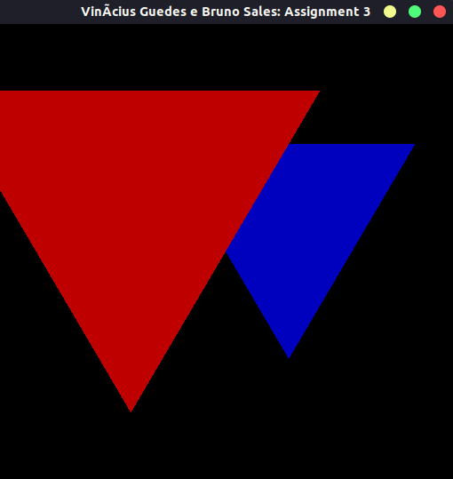


## Objetivos concluídos

- [x] Exercício 1 - Escala
- [x] Exercício 2 - Translação
- [x] Exercício 3 - Projeção Perspectiva
- [x] Exercício 4 - Posição da Câmera
- [x] Exercício 5 - Transformações Livres


## Utilização

Para executar o código primeiro deve-se criar o arquivo compilado para ser executado, para isso execute os seguintes comandos:

```sh
$ cd 03_transformations
$ make clean
$ make -f Makefile
```

Após isso, basta executar o programa da seguinte forma:
```sh
$ ./transform_gl
```

## Histórico de Lançamentos

* 0.0.1
    * Trabalho Concluído


### Alunos
<ul>
    <li>Bruno Oliveira Sales – 20160111893 – brunosales@eng.ci.ufpb.br</li>
    <li>Vinícius Guedes da Silva – 20190169366 – viniciusguedes@lavid.ufpb.br</li>
</ul>

Disponivel em:

[Repositório Atividade](https://github.com/capagot/icg)
